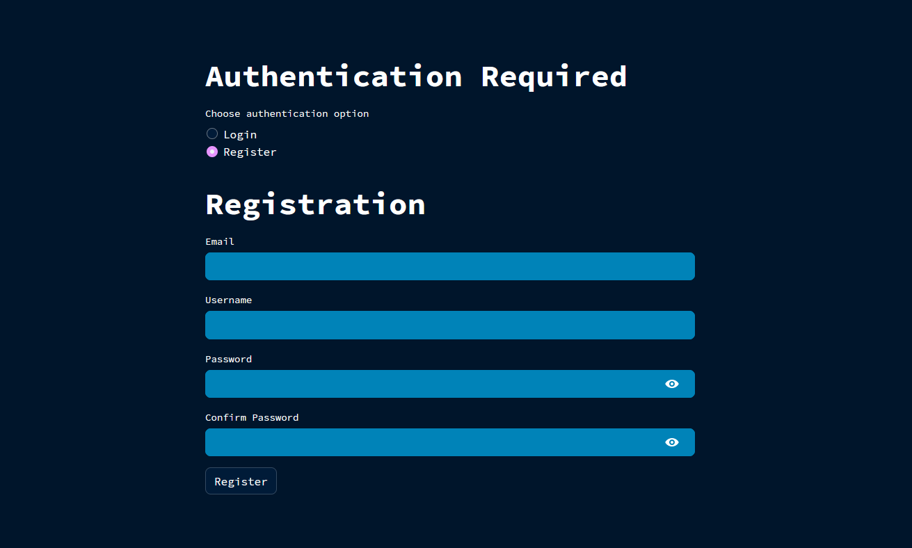
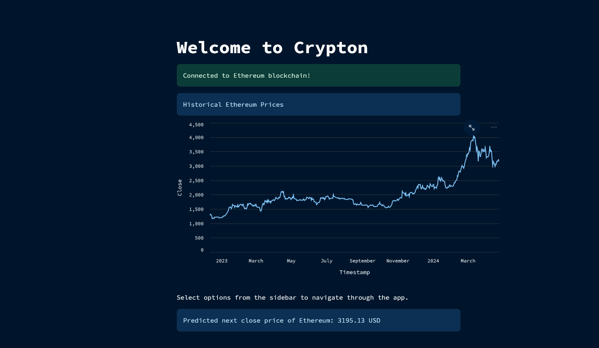
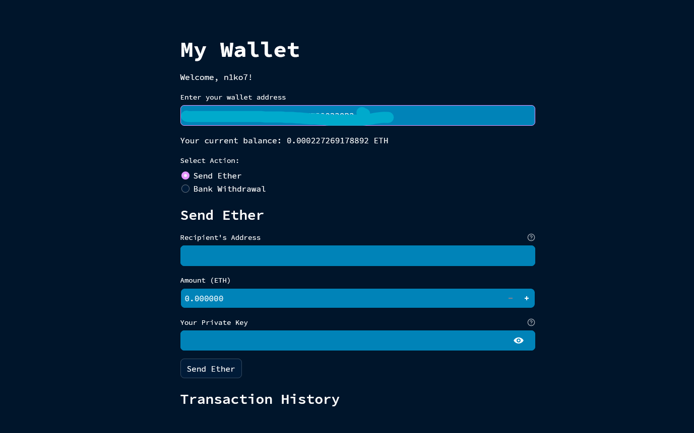

## How to use the Crypton?

### STEP #1
```python
git clone https://github.com/LukaNikolaisvili/Crypton.git
```
### STEP #2
```python
pip install -r requirements.txt
```
### STEP #3
```python
streamlit run .\Crypton.py
```
### STEP #4
Register 

### CHECK IT OUT:
---

### logo


### registration page


### home page


### Your wallet access



